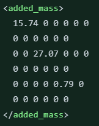

# Confirmar as modificações da Sophia

Created: February 20, 2023 4:02 PM

<aside>
📖 Confimar modificações da sophia:

</aside>

| Massa | 37.9 Kg |
| --- | --- |
| Center of gravity | (0; 0; 0.1) |
| Rho | 1023  |
| Inertia | ixx="0" ixy="0" ixz="0”
iyy="64.97" iyz="0”
izz="0” |
| Volume | 0.037039 m³ |
| Dimensoes | name="mandi2_length" value="0.57”
name="mandi2_width" value="0.38”
name="mandi2_height" value="0.38” |
| Matriz de massa adicional | 15.74 0 0 0 0 0
0 0 0 0 0 0
0 0 27.07 0 0 0
0 0 0 0 0 0
0 0 0 0 0.79 0
0 0 0 0 0 0 |
| quadratic_damping | 52.44; 0; 99.71; 0; 0.79; 0 |
| thrustMin | 73.58 |
| thrustMax | -32.37 |
| Bessa |  |
| delta L | -28 |
| delta R | 22 |
|  |  |
|  |  |

