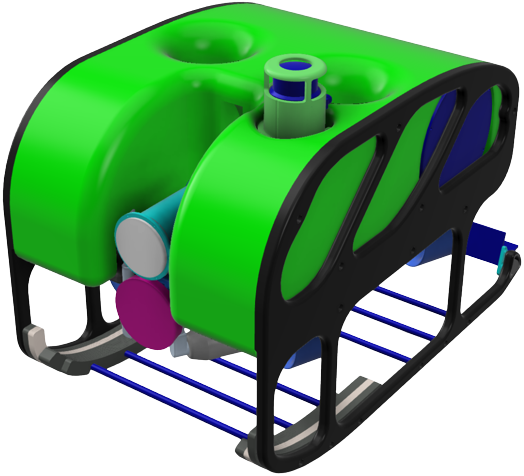

# Iniciação Científica

Coisas para fazer

1. [Implementar o Mandi II no simulador UUV_Sim](Implementar%20o%20Mandi%20II%20no%20simulador%20UUV_Sim%207405471c5d8845ba986e0991eca89a4b.md)
2. [Desenvolver o algoritimo de posicionamento servo visual](Desenvolver%20o%20algoritimo%20de%20posicionamento%20servo%20v%204bad35e5af1947eb86b8765ee007dea9.md)
3. [Estudar o uso de cameras de profundidade em ROVs](Estudar%20o%20uso%20de%20cameras%20de%20profundidade%20em%20ROVs%20f6da71bb0e104e07a235a24acbaf353f.md)

                     Mandi II - LVNT

[Implementar o Mandi II no simulador UUV_Sim](Implementar%20o%20Mandi%20II%20no%20simulador%20UUV_Sim%207405471c5d8845ba986e0991eca89a4b.md)

[Desenvolver o algoritimo de posicionamento servo visual](Desenvolver%20o%20algoritimo%20de%20posicionamento%20servo%20v%204bad35e5af1947eb86b8765ee007dea9.md)

[Estudar o uso de cameras de profundidade em ROVs](Estudar%20o%20uso%20de%20cameras%20de%20profundidade%20em%20ROVs%20f6da71bb0e104e07a235a24acbaf353f.md)

[https://github.com/lmartim4/Mandi2-Simulator](https://github.com/lmartim4/Mandi2-Simulator)

[Tarefas](Tarefas%20df9f921755b9471abd14cfd9598c0782.csv)